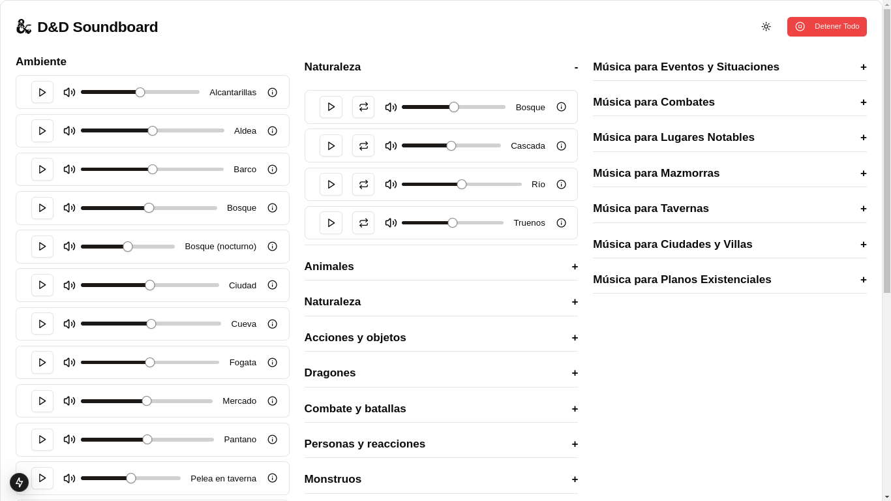

Suelo jugar Calabozos y Dragones con mis hijos, la ambientación auditiva la suelo hacer con Spotify y con YouTube, pero desde hace un tiempo los anuncios han hecho que deje de utilizar mi canal favorito, [Bardify](https://www.youtube.com/@bardify). Por este motivo he terminado construyendo una aplicación con [React](https://react.dev/) y [Next.js](https://nextjs.org) solo por diversión, un tablero de sonidos para la ambientación de partidas de rol.



## Empezando

Primero instalar dependencias:

```bash
npm install
```

Hay un problema con la dependencia fontawesome, en cuanto a la versión que descarga y su compatibilidad con React. Forzar la instalación permite que se instale de todas formas y corra el tablero de sonido:

```bash
npm install --force
```

Luego, solo hay que lanzar el servidor: 

```bash
npm run dev
```

Abrir [http://localhost:3000](http://localhost:3000) con el navegador, y tendremos nuestro tablero corriendo.

## Añadiendo Audios

Para evitar algún tema legal, este proyecto se distribuye sin archivos de audio. Los archivos de audio se añaden en el directorio: `public/audio`. Yo los mantengo con una estructura de prefijos antes del título: `ambience-autor-titulo`, `music-autor-titulo`, `sfx-autor-titulo`.

La aplicación originalmente admitía archivos de audio en formato `opus`, `mp3` y `wav`. Sin embargo al crecer la libería de audio (+7 GB), elimine el soporte de `mp3` y `wav` para evitar parsear archivos inexistentes ya que `opus` mantiene un mejor balance entre calidad y tamaño de archivo.

Para convertir archivos de otros formatos a `opus`, se puede emplear `ffmpeg`:

```bash
ffmpeg -i input.mp3 -c:a libopus -b:a 128k output.opus
```

La lista de audios que se muestran en el tablero se edita en `src/lib/audioFiles.ts`. Están ordenados en una especie de `array` organizado por secciones. El tablero se actualiza automáticamente al guardar los cambios, pero considerar añadir primero el audio al directorio de audios antes de añadirlo a `audioFiles.ts` para que se muestre inmediatamente y se pueda reproducir.

```TSX
  seccionespecifica: [
    { 
      name: "Audio de ejemplo", 
      url: "/audio/audio-example", 
      isLooping: true,
      license: "Autor"
    },
  ],
```

## Funcionamiento

El funcionamiento es simple. Solo hay que tocar el botón de _play_, el sonido fluirá. Pueden sonar varias pistas de audio a la vez, las cuales son resaltadas visualmente, cada una tiene su control de volumen individual. Los efectos de sonido se pueden configurar para reproducirse en _loop_ o una sola vez.

## Créditos

Los créditos de los audios son de sus respectivos autores. D&D Soundboard es contenido de fans no oficial permitido por la Política de contenido de fans. No está aprobado ni respaldado por Wizards of the Coast.